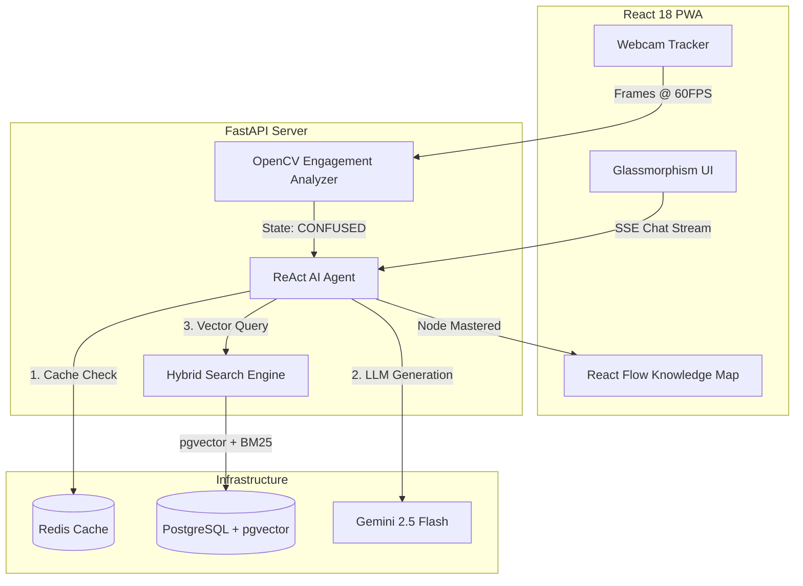

# 🚀 AI-STEAM-Lab

> **DSH Hacks V1 Finalist | Theme: AI x STEM Education**

AI-STEAM-Lab is not just an LLM wrapper. It is a **Real-Time, Context-Aware Educational Engine**. We combine sub-1.5s latency retrieval-augmented generation (RAG) with live computer vision engagement tracking to simulate a true 1-on-1 Socratic tutoring experience. 

When a student furrows their brow in confusion, our engine detects the cognitive load drop and dynamically simplifies the agent's vocabulary—in real time.

---

## 🌟 The Killer Features

1. **Live OpenCV Engagement Tracking** 
   Using eye aspect ratio (EAR) and head-pose estimation, our backend categorizes the student's state as `FOCUSED`, `CONFUSED`, or `DISENGAGED`.
   - **Confused?** The agent intercepts the context window and simplifies the pedagogy.
   - **Disengaged?** A 8-second timer triggers a gentle UI nudge to pull them back in.

2. **Hybrid RRF Search (pgvector + BM25)**
   We execute dense vector search (cosine similarity) alongside sparse keyword search, mathematically merged via **Reciprocal Rank Fusion**. If the confidence threshold drops below 0.72, the system admits it doesn't know rather than hallucinating.

3. **Dynamic Knowledge Graph**
   Powered by `NetworkX` and `React Flow`, we map 50+ core STEM concepts. If RAG confidence is low, the agent traverses the graph to find prerequisite concepts and seamlessly pivots the conversation to fundamentals.

---

## 🏗 System Architecture

---

## ⚡ Performance & Scale

- **Zero-Latency Feel**: By pre-warming the top 50 STEM embeddings in a Redis cache on startup, our Time-To-First-Token (TTFB) drops under 1.5 seconds.
- **Micro-Quiz Engine**: Instead of outputting essays, the agent forces Socratic micro-quizzes, advancing the React Flow graph only upon correct comprehension.
- **Accessibility**: Includes text-to-speech for visually impaired students and a dynamic Reading Level selector (Middle School → Undergrad).

---

## 🚀 Run it Locally

1. `docker-compose up -d` (Spins up Redis & pgvector)
2. `cd backend && pip install -r requirements.txt && uvicorn app.main:app --reload`
3. `cd frontend && npm install && npm run dev`
