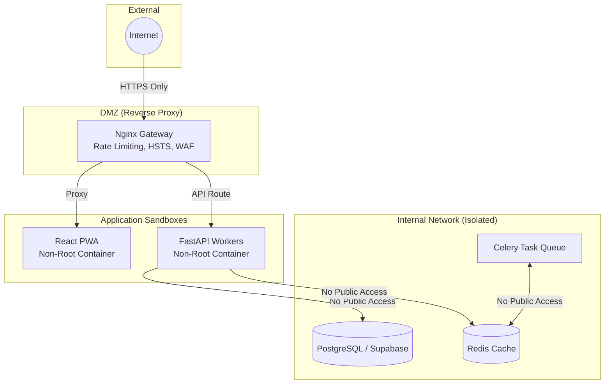

  <!-- Project Logo Placeholder -->
  

  # 🛡️ AI STEM Lab Assistant (NeuroLab) - Security Policy

  **Enterprise-Grade Security, Privacy, and AI Safety Framework**

  *Ensuring absolute data privacy, secure AI interactions, and robust infrastructure for the next generation of educational technology.*

  <!-- Badges -->
  
  
  
  

---

## 📑 Table of Contents
1. [Security Philosophy](#-1-security-philosophy)
2. [Supported Versions](#-2-supported-versions)
3. [Vulnerability Disclosure Policy](#-3-vulnerability-disclosure-policy)
4. [Infrastructure Security](#-4-infrastructure-security)
5. [Data Privacy & Computer Vision](#-5-data-privacy--computer-vision)
6. [AI Safety & Guardrails](#-6-ai-safety--guardrails)
7. [Authentication & Authorization](#-7-authentication--authorization)
8. [Incident Response Plan](#-8-incident-response-plan)
9. [Compliance & Regulations](#-9-compliance--regulations)

---

## 🏛️ 1. Security Philosophy

At NeuroLab, we believe that educational technology must adhere to the highest standards of security and privacy. Because our platform interacts with students and utilizes computer vision, we employ a **Zero Trust Architecture** and **Privacy-by-Design** principles. We assume that networks are hostile and enforce strict validation at every boundary.

---

## ✅ 2. Supported Versions

We provide security updates and patches for the following versions of the NeuroLab platform:

| Version | Supported | Notes |
| ------- | --------- | ----- |
| **v1.1.x** | ✅ Yes | Current Stable Release. Includes Vector RAG Memory and Docker updates. |
| **v1.0.x** | ✅ Yes | Initial MVP. Security patches provided for critical CVEs only. |
| **< v1.0** | ❌ No | Alpha/Beta releases are no longer supported. Please upgrade. |

---

## 🐛 3. Vulnerability Disclosure Policy

If you discover a security vulnerability or a jailbreak exploit within NeuroLab, **please do not disclose it publicly.** We take all reports seriously and will work rapidly to validate and patch the issue.

### Reporting Process:
1. Create a private security advisory on this GitHub repository, or email the maintainers directly at `vikassn44@gmail.com`.
2. Provide a detailed description of the issue, the affected component, and steps to reproduce the vulnerability.
3. Include any proof-of-concept (PoC) code or screenshots.

### Our Commitment:
- We will acknowledge receipt of your vulnerability report within **48 hours**.
- We will provide a triage assessment within **5 business days**.
- We will strive to send you regular updates regarding our patching progress.
- Reporters of valid, critical vulnerabilities will be credited in our release notes and acknowledgements.

---

## 🏗️ 4. Infrastructure Security

NeuroLab is deployed using a decoupled, containerized architecture that isolates workloads and limits the blast radius of any potential compromise.

### Key Infrastructure Mitigations:
- **Container Sandboxing:** All Docker containers execute as unprivileged users (e.g., `neurolabuser`, `nginx-unprivileged`). Attackers cannot gain host root access if a container is compromised.
- **Nginx Reverse Proxy:** Orchestrates routing and ensures internal ports are never exposed directly to the internet.
- **Dependency Scanning:** Automated AquaSecurity Trivy scans run on every PR to detect vulnerable NPM packages or Python modules.

---

## 👁️ 5. Data Privacy & Computer Vision

Given the platform's use of webcams for physics tracking, absolute data privacy is our highest priority.

| Privacy Pillar | Implementation Details |
| -------------- | ---------------------- |
| **No Video Storage** | The OpenCV tracking engine processes webcam frames in volatile memory (RAM). **No video feeds, raw images, or biometric data are ever saved to disk, logged, or transmitted to external servers.** |
| **Edge Processing** | Tracking logic runs locally within the browser or via ephemeral backend streams. Only anonymized numerical data (e.g., coordinates, velocity arrays) is retained. |
| **Ephemeral Sessions** | Chat sessions and telemetry streams are strictly isolated and cryptographically bound to the active user's JWT. |

---

## 🤖 6. AI Safety & Guardrails

Integrating LLMs into educational software introduces unique challenges, such as hallucinations and prompt injection. NeuroLab employs a multi-layered defense strategy:

- **Strict Persona Bounding:** The Gemini AI Tutor is constrained by immutable system prompts. It is strictly instructed to maintain a Socratic, educational tone and refuse inappropriate, harmful, or off-topic requests.
- **Anti-Hallucination Thresholds:** Our RAG pipeline uses Cosine Similarity search. We enforce a strict confidence threshold. If the vector match is poor, the system will politely decline to answer rather than hallucinating facts to a student.
- **Read-Only RAG:** The LLM agent operates with least-privilege. It possesses read-only access to the STEM Knowledge Graph and cannot directly execute arbitrary code or mutate database records.
- **Output Sanitization:** All AI-generated markdown is strictly sanitized on the frontend using `DOMPurify` to prevent Stored XSS attacks via malformed AI responses.

---

## 🔑 7. Authentication & Authorization

- **Cryptographic JWTs:** All backend API endpoints are secured via JWTs (JSON Web Tokens) signed with the `SUPABASE_JWT_SECRET` using the HS256 algorithm.
- **Strict CORS:** Cross-Origin Resource Sharing is strictly limited to authorized frontend origins.
- **No Secrets in Code:** Passwords, API keys, and connection strings are categorically excluded from version control via `.gitignore` and injected via secure environment variables.

---

## 🚨 8. Incident Response Plan

In the event of a confirmed security breach or data exposure:

1. **Containment:** Affected services, API keys (e.g., Gemini API), or database credentials will be immediately rotated or revoked.
2. **Investigation:** We will analyze server logs, Sentry APM traces, and container metrics to identify the root cause and extent of the breach.
3. **Remediation:** Emergency patches will be developed, tested via CI/CD, and deployed.
4. **Notification:** If user data is compromised, we will notify affected users within 72 hours, detailing the scope of the breach and the mitigating actions taken.

---

## 📜 9. Compliance & Regulations

NeuroLab is designed to be fully compliant with major educational and privacy regulations:

- **FERPA (Family Educational Rights and Privacy Act):** We ensure the strict confidentiality of student records and performance data.
- **COPPA (Children's Online Privacy Protection Act):** We do not harvest, sell, or exploit the personal information of minors. Webcam tracking is strictly ephemeral.
- **GDPR (General Data Protection Regulation):** We support the right to be forgotten. Users can permanently delete their accounts and associated telemetry data at any time.

---
*Document last updated: June 2026*
